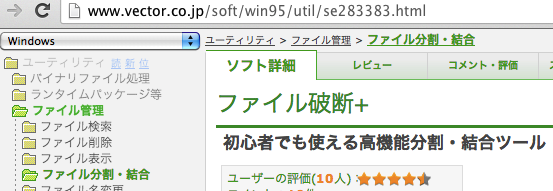

bpmappersの紹介
===============

セッションの説明
----------------

* bpmappersというPythonモジュールの説明です。

お前だれよ?
-----------

* 岡野 真也(@tokibito)
* Python使用歴6年ぐらい
* 株式会社ビープラウド勤務

昔作った
--------

.. s6:: styles

    'div': {textAlign: 'right'},
    'div/img': {width: '95%', margin: '5%'},

※この話はしません

bpmappersとは
-------------

* オブジェクト → 辞書のマッピング支援

背景
----

* モデルオブジェクトをJSONにしたい(=辞書にしたい)

  * json.dumpsはオブジェクトは不可

ここから始まった

例1.モデルクラス
-----------------

* こういうモデルのオブジェクトを辞書にしたい

.. code-block:: python

   class Book(object):
       def __init__(self, title, price, author):
           self.title = title
           self.price = price
           self.author = author

例1.マッピング用の関数
----------------------

* オブジェクトを引数に受け取って辞書を返す関数を作る

.. code-block:: python

   def book_to_dict(book):
       return {'title': book.title, 'price': book.price}

例1.結果
--------

.. code-block:: pycon

   >>> book1 = Book("Spam", 1000)
   >>> book2 = Book("Egg", 500)
   >>> print book_to_dict(book1)
   {'price': 1000, 'title': 'Spam'}
   >>> print(book_to_dict(book2))
   {'price': 500, 'title': 'Egg'}
   >>> print json.dumps(book_to_dict(book1))
   {"price": 500, "title": "Egg"}

この時点では問題なかった。

次に
----

::

   ＿人人人人人人＿
   ＞　仕様変更　＜
   ￣Y^Y^Y^Y^Y￣

(^_^;)

変更点1
-------

* authorも出せるようによろしく。
* authorだけのJSONも追加で。

例2.
----

次に
----

::

   ＿人人人人人人人人人＿
   ＞　さらに仕様変更　＜
   ￣Y^Y^Y^Y^Y^Y^Y^Y￣

（#^ω^）

変更点2
-------

* authorに属性持たせるのでよろしく

