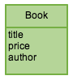
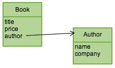
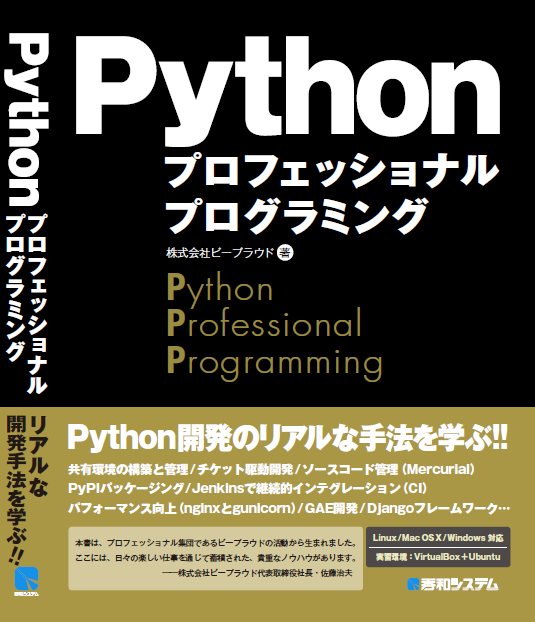

bpmappersの紹介
===============

お前だれよ?
-----------

* 岡野 真也(@tokibito)
* Python使用歴6年ぐらい
* 株式会社ビープラウド勤務

一昨日
------

チュートリアルB

実践で学ぶDjangoフレームワーク

10年前
------

.. figure:: _static/bpmappers-fcp.png

.. s6:: styles

    'div': {textAlign: 'right'},
    'div/img': {width: '95%', margin: '5%'},

※この話はしません

bpmappersとは
-------------

* オブジェクト → 辞書のマッピング支援

背景
----

* データモデルのオブジェクトをJSONにしたい(=辞書にしたい)

ここから始まった

例.モデルクラス
-----------------

* こういうモデルのオブジェクトを辞書にしたい

.. s6:: styles

    'div': {textAlign: 'center'},
    'div/img': {width: '20%'},

仕様1
-----

* BookモデルをJSONにする

次
--

::

   ＿人人人人人人＿
   ＞　仕様変更　＜
   ￣Y^Y^Y^Y^Y￣

(^_^;)

仕様2
-----

* Bookの構造が変わりました

.. s6:: styles

    'div': {textAlign: 'center'},
    'div/img': {width: '50%'},

次
--

::

   ＿人人人人人人＿
   ＞　仕様変更　＜
   ￣Y^Y^Y^Y^Y￣

（#^ω^）

仕様3
-----

* AuthorだけのJSON追加
* BookのtitleとAuthorのnameのみのJSONを追加

次
--

::

   ＿人人人人人人＿
   ＞　仕様変更　＜
   ￣Y^Y^Y^Y^Y￣

／(^o^)＼

仕様4
-----

* Authorはやっぱり複数で...

そしてどうなったか
------------------

* マッピング用の関数の見通しが悪くなった
* 欲しいデータが引数にない! → 修正箇所多数

＼(^o^)／

そこで
------

* 似たようなマッピングルールはまとめよう
* フックポイント用意して修正範囲減らそう

bpmappers
---------

1. Mapperクラスを継承
2. フィールドにマッピングルールを記述
3. ツリー構造はDelegateFieldでMapper指定

Djangoサポート
--------------

* bpmappers.djangomodel.ModelMapper
* DjangoのモデルからMapperクラスを生成
* ForeignKeyやManyToManyも追いかける

bpmappersのバージョン
---------------------

* 最新の安定版は0.7
* Python 2.5, 2.6, 2.7, 3.2, 3.3
* Django 1.0〜1.5, Py3kは3.2, 3.3

ドキュメント
------------

* http://bpmappers.readthedocs.org/
* Pythonプロフェッショナルプログラミング(15-02)

.. s6:: styles

    'div': {textAlign: 'center'},
    'div/img': {width: '30%'},

その他
------

* rebecca.todict_bpmappers
